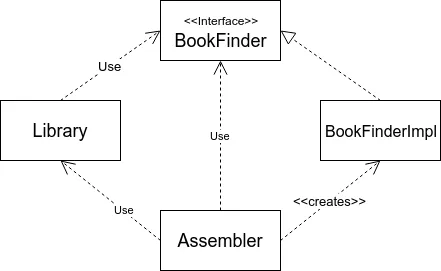

# DOJO Architecture hexagonale

## Introduction

Vous avez sûrement déjà entendu parler de l'architecture hexagonale, aussi appelée architecture ports et adaptateurs. Cette architecture est une manière de structurer votre code pour le rendre plus modulaire, plus testable et plus maintenable. Elle est particulièrement adaptée aux applications métier.

## Objectifs

Dans ce dojo, nous allons voir comment mettre en place une architecture hexagonale dans une application Java existante. Nous allons voir comment découper notre application en différents modules, comment les relier entre eux et comment les tester. Nous allons également voir comment tester notre architecture et s'assurer qu'aucune couche n'est polluée en mettant en place des test ArchUnit.

## Prérequis

- Java 21
- Maven
- Un IDE (IntelliJ IDEA, Eclipse, VS Code, etc.)
- Git
- Docker ou Podman

## Quelques notions

### Principes SOLID

Les principes SOLID sont fondamentaux pour comprendre pourquoi une architecture hexagonale peut être utile :

- Single Responsibility Principle : Un composant doit avoir une seule raison de changer, c'est-à-dire une seule responsabilité.
- Open/Closed Principle : Un composant doit être ouvert à l'extension, mais fermé à la modification, c'est-à-dire qu'on doit pouvoir ajouter des fonctionnalités sans modifier le code existant.
- Liskov Substitution Principle : Les objets d'une classe dérivée doivent pouvoir remplacer les objets de la classe de base sans affecter le comportement du programme, c'est-à-dire que les sous-classes doivent être substituables à la classe de base.
- Interface Segregation Principle : Les interfaces doivent être spécifiques aux besoins des clients, c'est-à-dire qu'on ne doit pas forcer les clients à implémenter des méthodes dont ils n'ont pas besoin.
- Dependency Inversion Principle : Les modules de haut niveau ne doivent pas dépendre des modules de bas niveau. Les deux doivent dépendre d'abstractions. Les détails doivent dépendre des abstractions.

Ces principes et notamment le plus crucial, le principe d'inversion de dépendance, sont au coeur de l'architecture hexagonale.

### Domain-Driven Design (DDD)

L'architecture hexagonale prend souvent racine dans les concepts de DDD.

Domaine Métier : Le cœur de l'application est la logique métier.
Ubiquitous Language : Un langage commun entre les développeurs et les experts métier.
Entities et Value Objects : Des objets qui représentent les concepts fondamentaux du métier.


### Inversion de Contrôle (IoC)

L'inversion de contrôle est un principe qui consiste à déléguer la gestion des dépendances à un conteneur IoC. Cela permet de rendre les composants indépendants des détails de leur création et de leur configuration.

Dependency Injection est une technique pour implémenter l'IoC. Les dépendances sont injectées dans les composants au lieu d'être créées par eux.



### Séparation des Préoccupations

Le but de l'architecture hexagonale est de séparer la logique métier des détails techniques (UI, bases de données, frameworks). Le cœur de l'application doit être indépendant des technologies et se concentrer uniquement sur le métier.


### Ports et Adaptateurs (Hexagone)

Ce sont les interfaces qui définissent les moyens par lesquels l'application interagit avec le monde extérieur, comme les interfaces utilisateur ou les appels à des API externes.


### Indépendance du Domaine

Le domaine métier doit être complètement indépendant des technologies utilisées (par exemple, la base de données ou le framework web). Les dépendances sont inversées (par exemple, la base de données dépend de la logique métier, et non l'inverse). On retrouve ce qui est préconisé par le principe SOLID 

> Dependency Inversion Principle : Le domaine métier ne dépend pas des détails techniques (base de données, framework), mais d’abstractions. Les dépendances sont inversées pour garantir l’autonomie du cœur métier.

### Facilité d'Extension

L'un des grands avantages de l'architecture hexagonale est la possibilité de changer les adaptateurs sans toucher au cœur de l'application. Par exemple, remplacer un système de persistance relationnel par une solution NoSQL est possible en changeant uniquement l'adaptateur correspondant.

> Open/Closed Principle : On peut ajouter ou remplacer des adaptateurs (ex : changer la persistance) sans modifier le domaine métier. Le système est ouvert à l’extension, fermé à la modification.

### Testabilité et Flexibilité

Étant donné que le domaine métier est indépendant, il devient facile de tester la logique métier avec des mockups ou des stubs pour les interactions externes.

> Single Responsibility Principle et Interface Segregation Principle : Le domaine métier a une seule responsabilité (la logique métier), ce qui facilite les tests. Les interfaces sont spécifiques, permettant de mocker facilement les dépendances externes.

### Synthèse

L'architecture hexagonale est une approche modulaire et flexible qui améliore la testabilité, la maintenabilité et l'évolutivité.

Elle est adaptée aux systèmes complexes, pas nécessaire pour les petits projets.

## Première étape : Découpage de l'application

L'application est conçue pour gérer efficacement les missions de sauvetage en assemblant et en gérant des flottes de vaisseaux spatiaux, tout en respectant les principes de conception modulaire et testable.

NB : Le code est inspiré de ce qui est présenté dans [L'Architecture Hexagonale par la pratique, le live coding qui rendra vos applications plus pérennes - YouTube](https://www.youtube.com/watch?v=-dXN8wkN0yk).

### Fonctionnalités principales

1. **Assembler une flotte de vaisseaux de sauvetage** :
    - **Entrée** : Une requête contenant le nombre de passagers à sauver (`RescueFleetRequest`).
    - **Processus** :
        - Le service `FleetAssemblerService` récupère une liste de vaisseaux spatiaux disponibles via une API externe (`SwapiResponse`).
        - Il filtre les vaisseaux ayant une capacité de passagers valide.
        - Il sélectionne les vaisseaux nécessaires pour atteindre ou dépasser le nombre de passagers spécifié, en tenant compte de la capacité minimale de cargo.
        - Il assemble ces vaisseaux en une flotte (`Fleet`).
        - La flotte est ensuite sauvegardée via le service `FleetsService`.
    - **Sortie** : Une réponse HTTP contenant la flotte assemblée (`FleetResource`).

2. **Obtenir une flotte de vaisseaux de sauvetage par son identifiant** :
    - **Entrée** : Un identifiant de flotte (`id`).
    - **Processus** :
        - Le service `FleetsService` récupère la flotte correspondante à l'identifiant fourni.
    - **Sortie** : Une réponse HTTP contenant les détails de la flotte (`FleetResource`).

### Composants principaux

1. **Contrôleur `RescueFleetController`** :
    - Gère les requêtes HTTP pour assembler une flotte et obtenir une flotte par identifiant.
    - Utilise les services `FleetAssemblerService` et `FleetsService` pour effectuer les opérations nécessaires.

2. **Service `FleetAssemblerService`** :
    - Responsable de l'assemblage des flottes de vaisseaux spatiaux.
    - Interagit avec une API externe pour récupérer les vaisseaux disponibles.
    - Filtre et sélectionne les vaisseaux en fonction de la capacité de passagers et de cargo.

3. **Service `FleetsService`** :
    - Gère la persistance et la récupération des flottes de vaisseaux spatiaux.

4. **Modèles et ressources** :
    - `Fleet` : Représente une flotte de vaisseaux spatiaux.
    - `StarShip` : Représente un vaisseau spatial individuel.
    - `RescueFleetRequest` : Représente une requête pour assembler une flotte.
    - `FleetResource` : Représente la ressource de réponse contenant les détails d'une flotte.

### Identifiez les domaines

- **Domaine Métier** : La logique de l'assemblage des flottes de vaisseaux spatiaux.
- **Domaine de Persistance** : La gestion de la persistance des flottes de vaisseaux spatiaux.
- **Domaine Externe** : L'interaction avec une API externe pour récupérer les vaisseaux spatiaux.
- **Domaine de Données** : Les modèles de données et les ressources.
- **Configuration** : La configuration de l'application.
**Application** : La gestion des requêtes HTTP et des réponses.

## Deuxième étape : Implémentation des modules

### Découpage en modules

1. **`rescue-model`** : Modèle Métier
    - `Fleet` : Représente une flotte de vaisseaux spatiaux.
    - `StarShip` : Représente un vaisseau spatial individuel.

2. **`rescue-domain`** : Domaine Métier
    - `FleetAssemblerService` : Assemble les flottes de vaisseaux spatiaux.
    - `FleetService` : Gère les flottes.
    - `StarShipInventoryService` : Gère l'inventaire des vaisseaux spatiaux.

3. **`starship-client-api`** : Domaine Externe
    - `StarShipInventoryApi` : Client pour l'API externe de vaisseaux spatiaux.
    - `SwapiResponse` : Réponse de l'API externe.
    - `SwapiStarShip` : Modèle de vaisseau spatial de l'API externe.

4. **`fleets-persistence`** : Domaine de Persistance
    - `FleetsDocumentRepository` : Interface pour la persistance des flottes.
    - `FleetsDocument` : Document pour la persistance des flottes.

5. **`rescue-application`** : Application
    - `RescueFleetController` : Contrôleur pour assembler et obtenir des flottes.
    - `RescueFleetRequest` : Requête pour assembler une flotte.
    - `FleetResource` : Ressource de réponse pour une flotte.

### Écriture des tests

Chaque module doit être testé de manière isolée. Les tests doivent couvrir les cas d'utilisation principaux et les cas limites. L'impact des dépendances externes est minimisé en utilisant des mock ou des stubs qui implémentent les interfaces requises.

#### ArchUnit

Les tests ArchUnit permettent de vérifier que l'architecture de l'application respecte les règles définies. Par exemple, on peut vérifier que les dépendances sont correctement orientées, que les packages sont correctement nommés, etc.

Dépendances :

```xml
<dependency>
    <groupId>com.tngtech.archunit</groupId>
    <artifactId>archunit-junit5</artifactId>
    <version>1.4.0</version>
    <scope>test</scope>
</dependency>
```

Exemple de règle ArchUnit :

```java
import com.tngtech.archunit.core.importer.ImportOption;
import com.tngtech.archunit.junit.AnalyzeClasses;
import com.tngtech.archunit.junit.ArchTest;
import com.tngtech.archunit.lang.ArchRule;
import org.springframework.stereotype.Component;
import org.springframework.stereotype.Service;

import static com.tngtech.archunit.lang.syntax.ArchRuleDefinition.classes;
import static com.tngtech.archunit.library.Architectures.layeredArchitecture;

@AnalyzeClasses(packages = "moon.mission.rescue", importOptions = ImportOption.DoNotIncludeTests.class)
public class HexagonalArchitectureTest {

    @ArchTest
    ArchRule hexagonal = layeredArchitecture()
            .consideringOnlyDependenciesInLayers()
            .layer("Domain").definedBy("moon.mission.rescue.domain..")
            .layer("Application").definedBy("moon.mission.rescue.application..")
            .layer("Fleet Adapter").definedBy("moon.mission.rescue.fleet..")
            .layer("StarShip Adapter").definedBy("moon.mission.rescue.starship..")
            .whereLayer("Application").mayNotBeAccessedByAnyLayer()
            .whereLayer("Fleet Adapter").mayNotBeAccessedByAnyLayer()
            .whereLayer("StarShip Adapter").mayNotBeAccessedByAnyLayer()
            .whereLayer("Domain").mayOnlyBeAccessedByLayers("Application", "Fleet Adapter", "StarShip Adapter")
            .as("Hexagonal Architecture");


    @ArchTest
    ArchRule domainShouldNotDependOnSpring = classes().that().resideInAPackage("moon.mission.rescue.domain..")
            .should().notBeMetaAnnotatedWith(Component.class)
            .andShould().notBeAnnotatedWith(Service.class)
            .as("Domain should not depend on Spring");
}
```

## Troisième étape : Exemple de changement d'adaptateur

L'un des avantages de l'architecture hexagonale est la facilité avec laquelle on peut changer les adaptateurs sans toucher au cœur de l'application. Par exemple, si on veut remplacer l'API externe de vaisseaux spatiaux par une base de données locale, on peut le faire en créant un nouvel adaptateur qui implémente l'interface `StarShipInventoryService`. Le cœur de l'application reste inchangé, car il ne dépend que de l'interface, pas de l'implémentation. Cela permet de tester et de valider le nouvel adaptateur sans impacter le reste de l'application.

## Conclusion

L'architecture hexagonale est un moyen puissant de structurer votre code pour le rendre plus modulaire, plus testable et plus maintenable. Elle vous permet de séparer la logique métier des détails techniques, de faciliter l'extension et de garantir l'indépendance des composants. En suivant les principes SOLID, DDD, IoC et en utilisant des tests ArchUnit, vous pouvez concevoir des applications robustes et évolutives.

Petit disclaimer : Ce type d'architecture n'est pas toujours nécessaire pour tous les projets. Il est important de choisir l'architecture qui convient le mieux à votre cas d'utilisation et de garder à l'esprit que la simplicité est souvent la meilleure solution.

## Ressources

- [Hexagonal Architecture - Alistair Cockburn](https://alistair.cockburn.us/hexagonal-architecture/)
- [Presentation Domain Data Layering by Martin Fowler](https://martinfowler.com/bliki/PresentationDomainDataLayering.html)
- [Architecture Hexagonale : trois principes et un exemple d'implémentation](https://blog.octo.com/architecture-hexagonale-trois-principes-et-un-exemple-dimplementation)
- [L'Architecture Hexagonale par la pratique, le live coding qui rendra vos applications plus pérennes - YouTube](https://www.youtube.com/watch?v=-dXN8wkN0yk)
- [Model Mitosis : ne plus se tromper entre les microservices et le monolithe](https://www.youtube.com/watch?v=HNQJW5iMZgQ)
- [Hexagonal at Scale, où l'art de découper et organiser ses services (C. Martraire)](https://www.youtube.com/watch?v=M6WVxCq2miU)

### Bonus sur le DDD

- [DDD, en vrai pour le développeur (Cyrille Martraire) - YouTube](https://www.youtube.com/watch?v=h3DLKrvp5V8)
- [DDD Vite Fait - pdf](http://seedstack.org/pdf/DDDViteFait.pdf)

